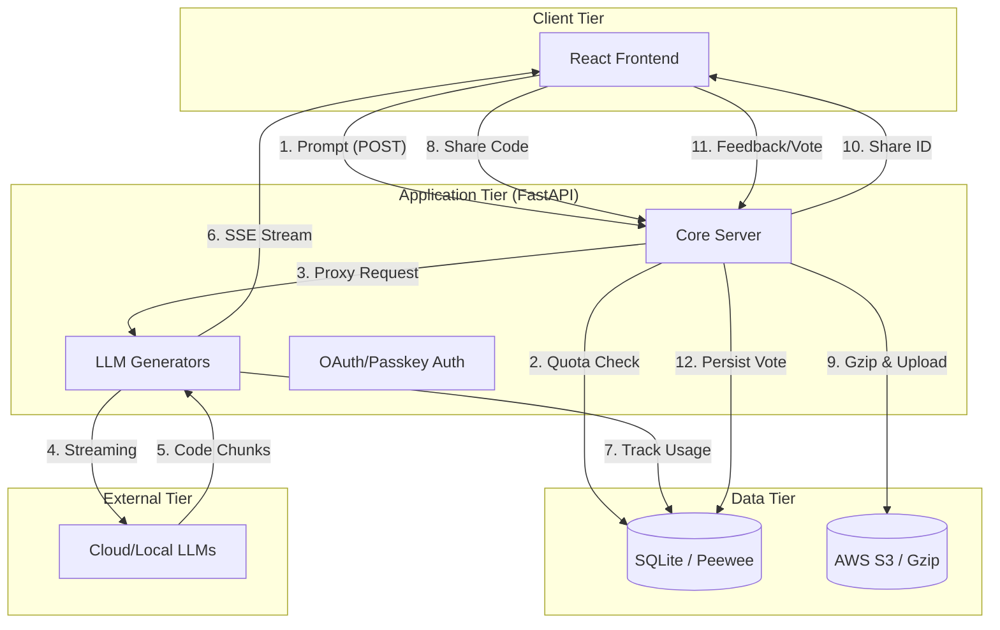

# OpenUI Backend Data Layers: Models & Storage

## 1. Overview
The OpenUI backend employs a multi-tiered data strategy to balance performance, local development ease, and cloud-based sharing. This includes a local relational database for application state and an S3-compatible cloud storage layer for shared assets.

## 2. Persistence Layer (SQLite)
The primary persistence for user metadata, sessions, and feedback is a SQLite database (managed via the **Peewee ORM**).

### 2.1. Entity Models (`openui/db/models.py`)
- **`User`**: Core user profile linked to GitHub SSO or WebAuthn credentials.
- **`Credential`**: Stores WebAuthn public keys and metadata for passwordless authentication.
- **`Session`**: Server-side session state containing serialized data (e.g., username, token counts).
- **`Component`**: Stores metadata and raw JSON for generated UI iterations.
- **`Vote`**: Captures user quality feedback (binary thumbs up/down) linked to specific components.
- **`Usage`**: Daily token consumption tracking per user, used to enforce quotas in production.
- **`SchemaMigration`**: Facilitates automated database schema updates as the application evolves.

### 2.2. Configuration
- **WAL Mode**: Enabled for improved concurrency during simultaneous reads and writes.
- **Pragmas**: Optimized cache size (64MB) and enforced foreign key constraints.

## 3. Storage Layer (S3-Compatible)
Cloud storage is used for components that need to be shared via a persistent public URL.

### 3.1. Implementation (`openui/util/storage.py`)
- **Gzip Compression**: All JSON payloads are compressed before upload to minimize storage costs and egress latency.
- **Public Access**: Files are uploaded to an S3 bucket with appropriate content-type (`application/json`) and content-encoding (`gzip`).
- **Endpoint Agnostic**: Uses `boto3` and supports custom `endpoint_url` for compatibility with AWS S3, MinIO, or R2.

## 4. API Data Models (Pydantic)
Formalized data structures used for validating incoming API requests, located in `openui/models.py`.

### 4.1. Request Models
- **`ShareRequest`**: Encapsulates the prompt, component name, emoji, and generated HTML/JS required for a cloud share.
- **`VoteRequest`**: Extends the share data with a boolean `vote` to capture quality feedback.

### 4.2. Utility Logic
- **`count_tokens`**: Utilizes the `tiktoken` library (cl100k_base encoding) to accurately calculate token usage from chat messages before proxying to the LLM.

## 5. Data Flow Architecture

### 5.1. System Data Flow Diagram
The following diagram illustrates the interaction between the client, backend services, persistent storage, and external AI providers.

### 5.2. Detailed Sequences

#### A. Interactive Generation Flow
1. **Request**: The client sends a prompt and model selection to `/v1/chat/completions`.
2. **Quota Validation**: The backend queries the `Usage` table in SQLite to verify the user hasn't exceeded their `MAX_TOKENS` daily limit.
3. **LLM Proxying**: The server initializes a provider-specific generator (`openai.py`, `ollama.py`, or `litellm.py`).
4. **Streaming Updates**: As the LLM streams tokens, the generator increments the local `input_tokens` and `output_tokens` counts.
5. **Persistence**: Final token counts are flushed to the `Usage` table via an atomic `ON CONFLICT` update.

#### B. Component Sharing Flow
1. **Serialization**: The frontend sends a `ShareRequest` containing the prompt and the full generated HTML/Tailwind payload.
2. **Compression**: The `util/storage.py` module encodes the payload to UTF-8 and compresses it using `gzip`.
3. **Cloud Storage**: The compressed byte-stream is uploaded to S3 with `Content-Encoding: gzip`.
4. **Referencing**: The backend provides a persistent CID (Content Identifier) that allows anyone with the URL to download and decompress the JSON via the GET `/v1/share/{id}` endpoint.

#### C. Authentication Flow
1. **Oauth Initiation**: `/v1/login` triggers a redirect to GitHub.
2. **Identity Verification**: Upon callback, the backend verifies the GitHub token and checks the `User` table.
3. **Session Genesis**: If the user is new, a UUID is generated and a `User` record is created. A signed session cookie is issued.
4. **Local Hydration**: The frontend uses the session cookie to fetch `SessionData`, which populates user preferences and consumption history from SQLite.
